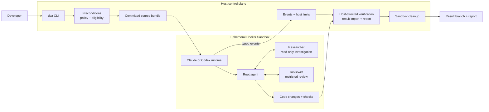

# Docker Coding Agent (DCA)

DCA runs a bounded software task in a fresh Docker Sandbox, verifies the result, and writes a completion report. A nonempty change set is returned on a Git branch. V1 supports trusted Claude and trusted Codex runs.

## What is DCA?

Give DCA a task for a local Git repository. The host launcher checks the request and environment, bundles the selected branch's committed source, creates an isolated sandbox, runs the coding agent, checks its work, retrieves the result, writes a report, and removes the sandbox. The developer's checkout is never mounted into the sandbox or silently changed by result retrieval.

## Architecture

Claude and Codex are **model backends**. Root, Researcher, and Reviewer are **logical agent roles** within either backend. Root does the coding work and can delegate investigation and review; the other roles have narrower capabilities.



The host controls eligibility, source delivery, run limits, final verification, retrieval, reporting, and cleanup. A trusted runtime kit in the sandbox supplies the agent instructions, skills, and tool policy gate. The host directs final checks inside the sandbox and records their results.

## Requirements

- A local Git repository with an attached branch and a clean checkout. By default, DCA bundles only committed content; `--ignore-uncommitted` explicitly runs from the branch despite local changes.
- Python 3.11 or newer, Git, Docker Desktop, Docker Sandboxes (`sbx`), and Docker Agent. The release was validated on macOS/arm64; other host platforms have not been validated for V1.
- Use [the current runtime pins](runtime/versions.yaml) for a validated run. These include `sbx` v0.43.0, Docker Agent v1.136.0, and Claude Code CLI 2.1.278. `sbx` 0.43.0 is also the minimum for the sandbox features DCA uses.
- Docker Sandboxes must be usable and signed in. SSH agent forwarding must be off, with no configured SSH agent socket. The global sandbox network policy must match the release evidence's default-deny policy.
- Sign in to the backend you select: Claude Code on the host for Claude, or `docker agent setup` and select ChatGPT for Codex. A full `dca verify` requires the Claude CLI and a present Codex ChatGPT sign-in file because both backends are currently available.
- Remove provider API key environment variables such as `ANTHROPIC_API_KEY` and `OPENAI_API_KEY`; DCA refuses their presence, even if a value is empty.

## Installation and setup

V1 has no package installer. Run it directly from a full repository checkout:

```sh
git clone https://github.com/full-stack-dev-johncastrosanabria/docker-coding-agent-v1.git
cd docker-coding-agent-v1
python3 --version
docker info
sbx version
docker agent version
```

Check the global sandbox policy with `sbx policy ls`. On a new Sandboxes installation **only if it reports that the policy is uninitialized**, run `sbx policy init deny-all`. If SSH forwarding is enabled, disable it with `sbx settings set ssh.agentForwardingEnabled false` and restart the sandbox daemon with `sbx daemon restart`. DCA checks these settings and does not change them for you.

Sign in to Claude Code on the host and check it with `claude auth status --text` for Claude runs. For Codex runs, use `docker agent setup` and select ChatGPT. Keep credential files and login output private. The current eligibility state is recorded in [gates/eligibility.json](gates/eligibility.json).

Use `bin/dca` from this checkout, or add its `bin` directory to your shell's `PATH`:

```sh
export PATH="$PWD/bin:$PATH"
```

## Verify the installation

From the DCA checkout, run:

```sh
bin/dca verify
```

It checks the repository's runtime configuration and gate evidence, version pins, network policy, backend availability signals, and live agent configuration. It does not prove that a provider will accept credentials on a later run. A successful run exits with status 0 and reports that verification passed. For basic environment checks, `docker info`, `sbx version`, and `sbx ls` should also succeed.

## Run a coding task

Point `--repo` at the **root of the target local Git repository**. Specify `--trust trusted`: the CLI's default is untrusted, which V1 blocks. Pass at least one deterministic `--verify` command that works inside the sandbox.

```sh
bin/dca run \
  --repo /path/to/project \
  --backend claude \
  --trust trusted \
  --task "Fix the median calculation for even-length inputs without changing its API." \
  --verify "python3 -m unittest -q"
```

For the same task with Codex, use `--backend codex` instead of `--backend claude`. `--task @path/to/task.txt` reads a task file, and `--verify` can be repeated. See `bin/dca run --help` for the complete flag list.

DCA sends the selected branch as a Git bundle; it does not mount the host checkout. On a nonempty result, it imports a validated bundle as `dca/<run-id>` in the target repository **without checking out or merging that branch**. The report's `change_set.branch` records the exact ref. By default, reports are written to `<repo>/../.dca-runs/<run-id>/report.json` and `report.md`; `--out` chooses another output directory.

### End-to-end example

Suppose a small Python project's median tests fail for an even-length list. Commit the starting project state, then run its check locally and ask DCA to fix it:

```sh
(cd /path/to/project && python3 -m unittest -q)  # failing median test
bin/dca run \
  --repo /path/to/project \
  --backend claude \
  --trust trusted \
  --task "Fix median() for even-length inputs and retain the existing API." \
  --verify "python3 -m unittest -q"
```

If the run succeeds, the final check passes, the result is available on the reported `dca/<run-id>` branch, and `report.json` plus `report.md` explain the changes and verification. DCA removes the sandbox. Review the result branch before deciding whether to merge it; the active branch in the target checkout stays as it was.

## V1 security model

- **Trusted backends:** Claude and Codex trusted runs have passed the project's production conformance and end-to-end paths. Untrusted execution is intentionally blocked by the current eligibility policy.
- **Ephemeral isolation:** each coding run uses a fresh Docker Sandbox. The host repository is delivered by bundle, not mounted. The sandbox is removed after the run.
- **Default-deny networking:** the global policy denies network access by default. DCA applies the access required by the selected backend and trust profile inside that boundary.
- **Host control:** the host checks eligibility and preconditions, counts events and enforces limits, directs final verification, validates and imports the result bundle, writes the final report, and cleans up. A trusted in-sandbox gate applies the tool policy; neither backend receives an unrestricted tool path.
- **Separated roles:** Root may delegate to a read-only Researcher and a capability-restricted Reviewer. The Reviewer can inspect changes but cannot use general write or shell tools.

These controls describe the validated trusted V1 paths. They are not a claim that an untrusted repository can safely run autonomously.

## Known V1 limitations

| Area | V1 status |
|---|---|
| Claude trusted / Codex trusted | Supported production paths. |
| Untrusted execution | Intentionally blocked. |
| Sandboxes and source | Ephemeral, local Docker Sandboxes; the host repository is not mounted. No remote or distributed execution. |
| Network | Default-deny; access is limited by backend and profile. |
| Installation | Run from the repository; no package installer. |
| Pull requests | No automatic PR creation or merge workflow. |
| Benchmark CLI | `dca bench` is a placeholder and exits with status 2. |

For exact runtime pins and eligibility, consult [runtime/versions.yaml](runtime/versions.yaml) and [gates/eligibility.json](gates/eligibility.json).
