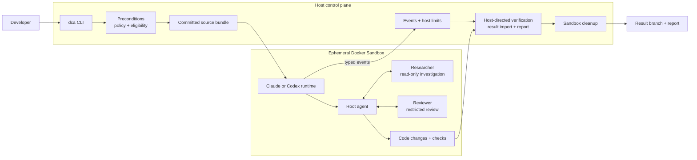

# Docker Coding Agent (DCA)

DCA runs a bounded software task in a fresh Docker Sandbox, verifies the result, and writes a completion report. A nonempty change set is returned on a Git branch. V1 supports trusted Claude and trusted Codex runs.

## What is DCA?

Give DCA a task for a local Git repository. The host launcher checks the request and environment, bundles the selected branch's committed source, creates an isolated sandbox, runs the coding agent, checks its work, retrieves the result, writes a report, and removes the sandbox. The developer's checkout is never mounted into the sandbox or silently changed by result retrieval.

## Architecture

Claude and Codex are **model backends**. Root, Researcher, and Reviewer are **logical agent roles** within either backend. Root does the coding work and can delegate investigation and review; the other roles have narrower capabilities.



The host controls eligibility, source delivery, run limits, final verification, retrieval, reporting, and cleanup. A trusted runtime kit in the sandbox supplies the agent instructions, skills, and tool policy gate. The host directs final checks inside the sandbox and records their results.

## Requirements

- A local Git repository with an attached branch and a clean checkout. By default, DCA bundles only committed content; `--ignore-uncommitted` explicitly runs from the branch despite local changes.
- Python 3.11 or newer, Git, Docker Desktop, Docker Sandboxes (`sbx`), and Docker Agent. The release was validated on macOS/arm64; other host platforms have not been validated for V1.
- Use [the current runtime pins](runtime/versions.yaml) for a validated run. These include `sbx` v0.43.0, Docker Agent v1.136.0, and Claude Code CLI 2.1.278. `sbx` 0.43.0 is also the minimum for the sandbox features DCA uses.
- Docker Sandboxes must be usable and signed in. SSH agent forwarding must be off, with no configured SSH agent socket. The global sandbox network policy must match the release evidence's default-deny policy.
- Sign in to the backend you select: Claude Code on the host for Claude, or `docker agent setup` and select ChatGPT for Codex. A full `dca verify` requires the Claude CLI and a present Codex ChatGPT sign-in file because both backends are currently available.
- Remove provider API key environment variables such as `ANTHROPIC_API_KEY` and `OPENAI_API_KEY`; DCA refuses their presence, even if a value is empty.

## Installation and setup

DCA runs from a checkout of this repository. Install the `dca` command into a virtual environment
as an **editable** install, so it keeps using this checkout's runtime assets and gate evidence:

```sh
git clone https://github.com/full-stack-dev-johncastrosanabria/docker-coding-agent-v1.git
cd docker-coding-agent-v1
python3 -m venv .venv
.venv/bin/python -m pip install -e .
mkdir -p ~/.local/bin && ln -sf "$PWD/.venv/bin/dca" ~/.local/bin/dca
dca --help
```

The link puts `dca` on your `PATH` if `~/.local/bin` is on it; otherwise run
`export PATH="$PWD/.venv/bin:$PATH"`. A copied (non-editable) install can't find the runtime assets
and refuses to run. `bin/dca` in the checkout accepts the same commands with nothing installed.

Sandboxes run a pinned Docker Agent binary that isn't stored in Git. Download it once into the
checkout and compare its digest with `docker_agent_artifact.sha256` in
[runtime/versions.yaml](runtime/versions.yaml):

```sh
mkdir -p gates/G6/work
curl -fsSL -o gates/G6/work/docker-agent-linux-arm64 \
  https://github.com/docker/docker-agent/releases/download/v1.136.0/docker-agent-linux-arm64
shasum -a 256 gates/G6/work/docker-agent-linux-arm64
```

DCA checks the digest itself and refuses any other binary. To keep the file elsewhere, set
`DCA_DOCKER_AGENT_ARTIFACT` to its path.

Check the global sandbox policy with `sbx policy ls`. On a new Sandboxes installation **only if it reports that the policy is uninitialized**, run `sbx policy init deny-all`. If SSH forwarding is enabled, disable it with `sbx settings set ssh.agentForwardingEnabled false` and restart the sandbox daemon with `sbx daemon restart`. DCA checks these settings and does not change them for you.

Sign in to Claude Code on the host and check it with `claude auth status --text` for Claude runs. For Codex runs, use `docker agent setup` and select ChatGPT. Keep credential files and login output private. The current eligibility state is recorded in [gates/eligibility.json](gates/eligibility.json).

## Quick start

In the project you want to change:

```sh
cd ~/code/my-project
dca init --backend claude --trust trusted --verify "python3 -m pytest -q"
dca verify
dca run "Fix the failing median tests"
```

- `dca init` records this checkout's settings once.
- `dca verify` checks that DCA, the environment and the backends are ready.
- `dca run` works on the repository you're in.

Choose `--trust trusted` only for a repository whose content you trust; see
[Local project configuration](#local-project-configuration).

## Local project configuration

`dca init` writes one checkout's settings to `.git/dca/config.toml`, readable and writable by you only:

```toml
version = 1
repository = "/Users/you/code/my-project"
backend = "claude"
trust = "trusted"

[verification]
commands = ["python3 -m pytest -q"]
```

- **Why it lives in `.git`:** Git never checks that directory out, so a repository you clone can't
  ship DCA settings. The file is never committed, never reported by `git status` and never included
  in the source bundle sent to the sandbox. A `.dca` or `dca.toml` file committed to a repository
  is just repository content and has no effect.
- **Precedence:** a command-line option wins, then the local config, then the default. `--verify`
  replaces the configured commands. `dca run` prints each setting with where it came from.
- **Trust:** the default is `untrusted`, which V1 blocks. Trust becomes `trusted` only when you pass
  `--trust trusted` or write it with `dca init --trust trusted`; a bare `dca init` writes
  `untrusted`.
- **Fails closed:** only the keys above are accepted. Any of the following stops `dca run` with
  exit 2:
  - an unknown key (for example `safety` or `network`);
  - an invalid value;
  - a file written for a different checkout;
  - a symlink;
  - a file other users can write.

  Fix it, or recreate it with `dca init --overwrite`.
- **Re-running `dca init`:** with the same settings it changes nothing; with different settings it
  refuses unless you pass `--overwrite`.

## Verify the installation

```sh
dca verify
```

It runs the checkout's verification checks ([scripts/verify.sh](scripts/verify.sh)) and shows one
line per area, with the reason and next step for anything that fails. It covers:

- runtime configuration and gate evidence;
- version pins and the network policy;
- backend sign-in signals and the live agent configuration.

Inside a project it also checks that checkout and its local config:

```text
DCA verify

  Repository        PASS     /Users/you/code/my-project (branch main, clean)
  Project config    PASS     backend claude · trust trusted · 1 verification command(s)
  Docker Sandboxes  PASS     no DCA sandboxes left behind
  Network policy    PASS
  Version pins      PASS
  Runtime assets    PASS
  Gate evidence     PASS
  Environment       PASS
  Claude            READY    trusted
  Codex             READY    trusted
  Untrusted runs    BLOCKED  by V1 eligibility policy (expected)

READY: DCA can run in this environment.
```

It exits 0 only when every check passes. It doesn't prove that a provider will accept credentials on a later run.

## Run a coding task

```sh
dca run "Fix the median calculation for even-length inputs without changing its API."
dca run --backend codex "Fix the median calculation for even-length inputs."
```

- **Task:** the quoted argument, or `@path/to/task.txt` to read it from a file.
- **Repository:** the one containing the current directory. A directory that isn't part of a
  repository's committed tree is refused, never guessed.
- **Backend, trust and verification commands:** from the local config unless you pass them.
- **Verification:** always give at least one deterministic command that works inside the sandbox,
  in the config or with `--verify`.

The fully explicit form works from anywhere, as before:

```sh
bin/dca run \
  --repo /path/to/project \
  --backend claude \
  --trust trusted \
  --task "Fix the median calculation for even-length inputs without changing its API." \
  --verify "python3 -m unittest -q"
```

See `dca run --help` for the complete flag list. A run prints its settings, one line per lifecycle
phase, and a summary:

```text
DCA run run-2026-09-22T20-24-29Z-2cd00d
  Repository  /Users/you/code/my-project
  Backend     claude   (local config)
  Trust       trusted   (local config)
  Verify      python3 -m unittest discover -s tests -t .   (local config)

  [1/7] Preconditions  PASS
  [2/7] Source bundle  PASS     main @ ce95011f25ab
  [3/7] Sandbox        READY    dca-run-2026-09-22T20-24-29Z-2cd00d
  [4/7] Agent          RUNNING
  [4/7] Agent          DONE     40s
  [5/7] Verification   PASS     1/1 check(s) passed
  [6/7] Retrieval      PASS     1 file(s) changed
  [7/7] Cleanup        PASS     sandbox removed

DCA SUCCEEDED

  Backend        claude
  Run            run-2026-09-22T20-24-29Z-2cd00d
  Verification   PASS (1/1)
  Files changed  1
  Result         dca/run-2026-09-22T20-24-29Z-2cd00d
  Report         /Users/you/code/.dca-runs/run-2026-09-22T20-24-29Z-2cd00d/report.md
  Cleanup        sandbox removed
  Duration       1m 40s
```

When a run stops early, it names the phase, the reason and what to do. For example, a checkout with
uncommitted changes stops before any sandbox exists:

```text
dca: BLOCKED during Preconditions (precondition failed, exit 3)
  the checkout has uncommitted or untracked changes and only committed state is delivered: notes.txt; commit them or re-run with --ignore-uncommitted
  No sandbox was created and no report was written.
```

Exit codes are listed in the [CLI contract](specs/001-bounded-coding-agent/contracts/launcher-cli.md#exit-codes).

DCA sends the selected branch as a Git bundle; it does not mount the host checkout. On a nonempty result, it imports a validated bundle as `dca/<run-id>` in the target repository **without checking out or merging that branch**. The report's `change_set.branch` records the exact ref. By default, reports are written to `<repo>/../.dca-runs/<run-id>/report.json` and `report.md`; `--out` chooses another output directory.

### End-to-end example

Suppose a small Python project's median tests fail for an even-length list. Commit the starting project state, then run its check locally and ask DCA to fix it:

```sh
cd /path/to/project
python3 -m unittest -q                       # failing median test
dca init --backend claude --trust trusted --verify "python3 -m unittest -q"
dca run "Fix median() for even-length inputs and retain the existing API."
```

If the run succeeds, the final check passes, the result is available on the reported `dca/<run-id>` branch, and `report.json` plus `report.md` explain the changes and verification. DCA removes the sandbox. Review the result branch before deciding whether to merge it; the active branch in the target checkout stays as it was.

## Benchmark reliability

`dca bench` measures how consistently DCA completes a set of small, deterministic coding tasks. Each fixture in [benchmark/fixtures/](benchmark/fixtures/) is a tiny repository with a task, a verification command and a hidden oracle ([format](benchmark/FORMAT.md)). The suite covers Python and JavaScript bug fixes, adding tests, a refactor, a config change, diagnosing a failing test, a multi-file change, a direct task, and two planned tasks.

```sh
bin/dca bench --backend claude            # every fixture, once, on Claude trusted
bin/dca bench --backend both --fixtures 'K1,M*' --repeat 2
```

**Every fixture run is a real production `dca run`**: the same eligibility checks, policy, sandbox, host limits, verification, retrieval and cleanup, against the real model backend. Provider availability, rate limits, quota and cost therefore affect a benchmark exactly as they affect a normal run. A full suite on one backend is 10 sandbox runs.

A run **passes** only when it meets every condition:

- the completion report is schema-valid and `succeeded`;
- the fixture's oracle accepts the delivered branch. The oracle runs hidden tests and restores the original tests, and it executes offline in the pinned sandbox base image, never on the host;
- every change is inside the fixture's allowed scope;
- no sandbox is left behind.

A precondition refusal or a `blocked` outcome is counted as **blocked**, and everything else as **failed**. Results are written to `benchmark/results/<bench-id>/benchmark.json` (machine-readable) and `benchmark.md` (a per-run table and a summary). Per-run artifacts such as reports and event streams stay under `benchmark/work/`. Git ignores both, so a bench run leaves the working tree clean. Compact summaries of accepted campaigns are committed under `benchmark/baselines/`. The exit status is 0 only when every run passed. `--acceptance` (the specification's 28-fixture acceptance protocol) is not available for this suite and is refused.

## V1 security model

- **Trusted backends:** Claude and Codex trusted runs have passed the project's production conformance and end-to-end paths. Untrusted execution is intentionally blocked by the current eligibility policy.
- **Ephemeral isolation:** each coding run uses a fresh Docker Sandbox. The host repository is delivered by bundle, not mounted. The sandbox is removed after the run.
- **Default-deny networking:** the global policy denies network access by default. DCA applies the access required by the selected backend and trust profile inside that boundary.
- **Host control:** the host checks eligibility and preconditions, counts events and enforces limits, directs final verification, validates and imports the result bundle, writes the final report, and cleans up. A trusted in-sandbox gate applies the tool policy; neither backend receives an unrestricted tool path.
- **Separated roles:** Root may delegate to a read-only Researcher and a capability-restricted Reviewer. The Reviewer can inspect changes but cannot use general write or shell tools.

These controls describe the validated trusted V1 paths. They are not a claim that an untrusted repository can safely run autonomously.

## Known V1 limitations

| Area | V1 status |
|---|---|
| Claude trusted / Codex trusted | Supported production paths. |
| Untrusted execution | Intentionally blocked. |
| Sandboxes and source | Ephemeral, local Docker Sandboxes; the host repository is not mounted. No remote or distributed execution. |
| Network | Default-deny; access is limited by backend and profile. |
| Installation | Editable install from a checkout (`pip install -e .`) or `bin/dca`; no published package. |
| Pull requests | No automatic PR creation or merge workflow. |
| Benchmark | `dca bench` runs a 10-fixture reliability suite; the 28-fixture `--acceptance` protocol is not implemented. |

For exact runtime pins and eligibility, consult [runtime/versions.yaml](runtime/versions.yaml) and [gates/eligibility.json](gates/eligibility.json).
